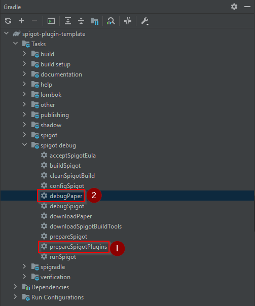

# Spigot Plugin Template

[](../../actions?query=workflow%3ABuild)
[](../../releases)

[](https://www.spigotmc.org/resources/splugintemplate.79903/)
[](https://www.spigotmc.org/resources/splugintemplate.79903/)
[](https://codecov.io/gh/Silthus/spigot-plugin-template)
[](http://commitizen.github.io/cz-cli/)
[](https://github.com/semantic-release/semantic-release)
[](https://discord.gg/R4st4QxAjb)

You can use this template to develop your own high quality Spigot plugins using [Gradle](https://gradle.org/) with ease.

> See the [minecraft-server-template](https://github.com/Silthus/minecraft-server-template) for quick starting your Minecraft network in under 30 seconds.

* [Features](#features)
* [Quickstart setup](#quickstart-setup)
* [Releasing a new version of your plugin](#releasing-a-new-version-of-your-plugin)
  * [Commit message format](#commit-message-format)
* [Publishing your maven package](#publishing-your-maven-package)
  * [About the group and artifactId](#about-the-group-and-artifactid)
  * [Github Package Authentication](#github-package-authentication)
* [Debugging your plugin](#debugging-your-plugin)
  * [Copy your plugin automatically](#copy-your-plugin-automatically)
  * [Running and debugging the Minecraft server](#running-and-debugging-the-minecraft-server)
* [References](#references)

## Features

The template or better boilerplate comes with a lot of features that are useful if you want to develop high quality plugins. However you don't need to use all of them, you can simply remove the features you don't need.

* Ready to use [**Gradle**](https://gradle.org/) project with lots of utility tasks
* Automatic **generation of `plugin.yaml`** based of project properties with [SpiGradle](https://github.com/EntryPointKR/Spigradle/)
* Integrated [**Spigot test server**](https://github.com/EntryPointKR/Spigradle/) with a one click build, copy plugin and start debugging in IntelliJ task 
* [**Gradle shadow plugin**](https://imperceptiblethoughts.com/shadow/) to easily ship your needed dependencies with your plugin
* Example integrations including tests for the [Annotation Command Framework](https://github.com/aikar/commands/) and [Vault](https://github.com/MilkBowl/VaultAPI).
* **[JUnit 5](https://junit.org/junit5/docs/current/user-guide/)** test setup including [MockBukkit](https://github.com/seeseemelk/MockBukkit) and [AssertJ](https://joel-costigliola.github.io/assertj/)
* **[Jacoco](https://github.com/jacoco/jacoco) code coverage** report including an upload task to [codecov](https://codecov.io/) 
* Fully integrated [**semantic-release**](https://semantic-release.gitbook.io/semantic-release/) release pipeline 
* Automatic [**changelog generation**](https://github.com/semantic-release/changelog) based on [conventional commit messages](https://www.conventionalcommits.org/)
* [**Github Actions**](https://github.com/features/actions) workflow for build and release
* Publishing of **maven artifacts** to [GitHub Packages](https://github.com/features/packages)
  > no more need for self hosted nexus or artifactory server
* GitHub [**issue templates**](https://help.github.com/en/github/building-a-strong-community/configuring-issue-templates-for-your-repository) for bug and feature requests
* Contributing and Code of Conduct **guidelines**
* Nice [**badges**](https://shields.io) to show of your project

## Quickstart setup

* Create a [new Github project](https://github.com/Silthus/spigot-plugin-template/generate) using this template.
* **Clone** the new repository and open it in IntelliJ.
* **Update** the **gradle.properties** file and change the following variables:
  * `group`: your-maven-group-id (e.g.: io.github.silthus)
  * `pluginName`: YourPluginName
  * `author`: YourName
* **Update** the `root.projectName` inside **settings.gradle**. This will be your `artifactId`.
* **Delete** the  `CHANGELOG.md`. It will be generated on your [first release](#releasing-a-new-version-of-your-plugin).
* **Update** the `README` to point to your project and spigot resource id.
* **Rename** the java package and plugin to match your project.
* Then execute the `prepareSpigotPlugins` gradle task this will try to download all plugin denpendencies and puts them into `debug/spigot/plugins/`.
* **Start** the Minecraft server by executing the `debugPaper` task. This will start the server in the background and you can connect to it using the `localhost:25565` address.
* **Code away :)** - *and once you are ready, push your commit (in [conventional commit style](#commit-message-format)) to master.*



Please read the [Contributing Guidelines](CONTRIBUTING.md) before submitting any pull requests or opening issues.

> **NOTE**  
> You might need to run the `gradle clean` task after renaming the packages and reimport the gradle project to resolve errors with generating the `plugin.yml`.

## Releasing a new version of your plugin

One of the major benefits of this template is the fact that it will **automatically release a new version** on every push to `master` based on your commit messages. This makes sure your plugin is released following the [semantic versioning](https://semver.org/) guidelines. For this to work you have to follow a few simple rules:

* Commit only working and tested code to the master branch. *Use Pull Requests to work on bigger features or bug fixes and merge them when you are ready.*
* Every bugfix, feature and change should have one commit associated with it. *Do not mix multiple bugs, features, etc. into one huge commit message. Keep your commit size small and commit often.*
* Your commit messages must follow the [conventional commit rules](https://www.conventionalcommits.org/).

### Commit message format

See the [conventional commit homepage](https://www.conventionalcommits.org/) for more details and examples on the topic. But here is a quick summary to get you started.

> The Conventional Commits specification is a lightweight convention on top of commit messages. It provides an easy set of rules for creating an explicit commit history; which makes it easier to write automated tools on top of. This convention dovetails with [SemVer](http://semver.org/), by describing the features, fixes, and breaking changes made in commit messages.

The commit message should be structured as follows:

```text
<type>[optional scope]: <description>

[optional body]

[optional footer(s)]
```

The commit contains the following structural elements, to communicate intent to the consumers of your library or plugin:

* `fix:` a commit of the type fix patches a bug in your codebase (this correlates with PATCH in semantic versioning).
* `feat:` a commit of the type feat introduces a new feature to the codebase (this correlates with MINOR in semantic versioning).
* `BREAKING CHANGE:` a commit that has a footer BREAKING CHANGE:, or appends a ! after the type/scope, introduces a breaking API change (correlating with MAJOR in semantic versioning). A BREAKING CHANGE can be part of commits of any type.
* types other than fix: and feat: are allowed, for example @commitlint/config-conventional (based on the the Angular convention) recommends `build:`, `chore:`, `ci:`, `docs:`, `style:`, `refactor:`, `perf:`, `test:`, and others.
* footers other than `BREAKING CHANGE: <description>` may be provided and follow a convention similar to git trailer format.
Additional types are not mandated by the Conventional Commits specification, and have no implicit effect in semantic versioning (unless they include a BREAKING CHANGE).

A scope may be provided to a commit’s type, to provide additional contextual information and is contained within parenthesis, e.g., `feat(parser): add ability to parse arrays`.

Here are some examples:

<details>
<summary>Commit message with description and breaking change footer</summary>

```text
feat: allow provided config object to extend other configs

BREAKING CHANGE: `extends` key in config file is now used for extending other config files
```

</details>

<details>
<summary>Commit message with no body</summary>

```text
docs: correct spelling of CHANGELOG
```

</details>

<details>
<summary>Commit message with scope</summary>

```text
feat(lang): add polish language
```

</details>

<details>
<summary>Commit message with multi-paragraph body and multiple footers</summary>

```text
fix: correct minor typos in code

see the issue for details

on typos fixed.

Reviewed-by: Z
Refs #133
```

</details>

## Publishing your maven package

Your plugin will be automatically published as a maven package on [Github packages](https://github.com/features/packages) as soon as you [release a new version](#releasing-a-new-version-of-your-plugin).

### About the group and artifactId

The `group` appended by your `artifactId` is used to uniquely identify your project when importing it in other projects. When you import spigot in your project you use the group `org.spigotmc` followed by the artifactId `spigot-api` and the version.

The following was taken from the [offical maven naming guide](https://maven.apache.org/guides/mini/guide-naming-conventions.html).

* `groupId` uniquely identifies your project across all projects. A group ID should follow [Java's package name rules](https://docs.oracle.com/javase/specs/jls/se6/html/packages.html#7.7). This means it starts with a reversed domain name you control. For example: `org.apache.maven`, `org.apache.commons`.  
  If you dont't own a domain, you can use the github domain `io.github` appended by your Github username, e.g. `io.github.silthus`
* `artifactId` is the name of the jar without version. If you created it, then you can choose whatever name you want with lowercase letters and no strange symbols. For example: `maven, commons-math

### Github Package Authentication

You need to configure [authentication for Github Packages](https://help.github.com/en/packages/using-github-packages-with-your-projects-ecosystem/configuring-gradle-for-use-with-github-packages#authenticating-to-github-packages) if you want to use your maven package in other projects.

1. [Create a Github Personal Access Token](https://help.github.com/en/github/authenticating-to-github/creating-a-personal-access-token-for-the-command-line)
2. Create or update the `gradle.properties` inside `C:\Users\%username%\.gradle` with the following and replace `YOUR_GITHUB_USERNAME` with your Github username and `YOUR_PERSONAL_ACCESS_TOKEN` with the access token from step 1.

```properties
gpr.user=YOUR_GITHUB_USERNAME
gpr.key=YOUR_PERSONAL_ACCESS_TOKEN
```

## Debugging your plugin

### Copy your plugin automatically

You can export your plugin to the plugins directory from your working directory with the Gradle **prepareSpigotPlugins** task. The task will **build and copy** your plugin **automatically** into the `plugins/` directory.

### Running and debugging the Minecraft server

You can run or debug your plugin using the `Server` run configuration from within IntelliJ to automatically download the Minecraft server, built it, copy your and dependent plugins into it and start it in debugging mode.

This is due to the awesome power of Spigradle's debug tasks. Find out more on the [Spigradle Github page](https://github.com/spigradle/spigradle).

## References

* [Spigradle](https://github.com/spigradle/spigradle/): *provides awesome gradle tasks that make your live a lot easier*
* [semantic-release](https://semantic-release.gitbook.io/semantic-release/): *in my opinion every project should use this!*
* [conventional commit messages](https://www.conventionalcommits.org/): *do commit message the right way*
